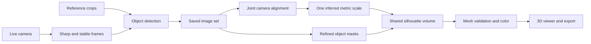

<div align="center">

# DepthCloud

**From webcam views to an explorable 3D object.**

A local reconstruction studio for collecting steady images, aligning cameras, and building a colored outer-shape mesh.

[](LICENSE)
[](#requirements)
[](#requirements)
[](#what-it-does)
[](#current-status)

[Quick start](#quick-start) · [How to use](#how-to-use) · [Development](docs/DEVELOPMENT.md) · [Credits & licenses](THIRD_PARTY_NOTICES.md)

</div>

---

## What it does

DepthCloud combines local object recognition, camera reconstruction, and silhouette-based geometry in one browser workspace. Keep the object and background stationary, move the camera through overlapping angles, then reconstruct the saved images.

| Capability | What you get |
| :--- | :--- |
| Live camera workspace | USB camera discovery, preview modes, buffer controls, and measured telemetry |
| Detection references | Crops of the same object from multiple angles guide later detection |
| Stable image collection | Sharp, steady detections saved at least 1.25 seconds apart; pause and resume |
| Shared camera reconstruction | COLMAP feature matching, triangulation, and joint bundle adjustment |
| Colored 3D surface | One silhouette-constrained volume with a common depth-derived scale |
| Inspect and export | Pan, orbit, view presets, OBJ mesh and PLY point-cloud export |
| Local integrations | Eight read-only MCP tools and an Isaac Sim export/coordinate descriptor |

> [!IMPORTANT]
> Geometry and dimensions are **estimates**. The primary method reconstructs an outer shape from silhouettes; it cannot measure hidden concavities. Image count, watertightness, and outline agreement do not establish physical accuracy.

## Quick start

### Requirements

The verified workstation uses **Windows x64**, embedded **CPython 3.14.2**, **Node.js 22.17.0**, and a USB webcam. GPU inference was exercised on an NVIDIA RTX 5090 with the existing CUDA-enabled PyTorch installation. CPU fallback exists, but full-model CPU performance has not been validated; the tested GPU is not an established minimum requirement.

> [!NOTE]
> This repository contains source code, not a packaged installer. The prepared Python runtime, installed dependencies, model weights, capture data, and built frontend are excluded from Git. A clean-machine Python/CUDA bootstrap is **not yet verified**. Start with the [environment preparation guide](docs/DEVELOPMENT.md#environment-preparation) if you have a fresh clone.

To obtain the source, run from your chosen local development directory:

```powershell
git clone https://github.com/shiwamshoryasharma/DepthCloud.git
Set-Location DepthCloud
```

### 1. Prepare the local models

Obtain weights from the official [Apple Depth Pro repository](https://github.com/apple/ml-depth-pro) and [DETR ResNet-50 model page](https://huggingface.co/facebook/detr-resnet-50), following their respective terms. Place these files under the repository root:

```text
backend/.models/
├── depth_pro.pt
└── detr-resnet-50/
    ├── config.json
    ├── preprocessor_config.json
    └── model.safetensors
```

DepthCloud loads these files locally and does not automatically download weights. See [third-party notices](THIRD_PARTY_NOTICES.md) for the distinction between application code, model code, and weights.

### 2. Build the interface

From the repository root, with frontend prerequisites installed:

```powershell
Set-Location app
$env:npm_config_cache = Join-Path (Resolve-Path '..\backend').Path '.cache\npm'
npm ci
npm run build
Set-Location ..
```

### 3. Start the backend

With the prepared backend runtime and dependencies in place, run from the repository root:

```powershell
Set-Location backend
if (!(Test-Path .env)) { Copy-Item .env.example .env }
.\python.bat run.py
```

Open **[DepthCloud](http://127.0.0.1:8765/)**. The backend serves the built interface; interactive API documentation is at **[/docs](http://127.0.0.1:8765/docs)**.

Use one backend process. Settings are listed in [backend/.env.example](backend/.env.example); restart after changing them. Keep the server on loopback: it is a single-user workstation without remote authentication.

## How to use

1. **Set up the camera.** Open **1 · Setup**, discover or select a device, choose a resolution, and click **Start camera**. Requested FPS may differ from the measured capture rate.
2. **Add detection references.** Click **Add detection reference**, crop the complete object, and repeat from several angles. Leave the desired references included in the gallery. These examples identify the object; they never become reconstruction inputs.
3. **Collect overlapping views.** Click **Collect 1,000 images**. Keep the object and scene still. Move the camera slowly around the object, pausing briefly for sharp captures and including higher and lower angles. Check the saved images and guidance as you go.
4. **Build the saved set.** At 1,000 accepted images, collection seals automatically and reconstruction starts. For a shorter scan, select **Pause collection**, then **Build saved images now**. At least three images are required, with enough overlap and camera separation to solve geometry.
5. **Inspect the result.** Review aligned/rejected counts, camera span, outline agreement, and the alignment report. Use **Pan**, **Orbit**, and view presets to examine the mesh. These checks reveal consistency, not guaranteed accuracy.
6. **Export.** Download the **OBJ mesh** or **PLY point cloud**. Exports use meters in the first accepted camera frame: X right, Y down, Z forward. The dimensions use an inferred scale.

> [!TIP]
> Start with a short capture to check recognition and overlap before collecting 1,000 images. A full set takes roughly **20 minutes 50 seconds or longer** at the capture cadence; blur and failed detections extend that time. More images cannot repair disconnected viewpoints or a moving scene.

### Pause, resume, and recovery

- **Pause collection** keeps the unfinished set. **Resume collection** requires the same camera resolution and physical scene.
- Building seals the set. Subsequent live frames cannot change that reconstruction; **Rebuild saved set** uses the retained images and can run with the camera off.
- Original images, masks, capture-time reference snapshots, calibration metadata, and the validated saved-set mesh survive backend restart. Mesh restoration checks its integrity hash.
- **Discard capture set** asks for confirmation and removes that temporary set and its reconstruction. It retains the manual reference gallery for the current process.
- The **manual reference gallery and legacy live/batch results are RAM-only**. Export legacy geometry and calibration before closing the backend.

Capture files remain in `backend/.cache/capture-session`, with a **16 GiB budget** and **1 GiB free-disk reserve**. They are not committed to Git.

<details>
<summary><strong>Advanced workflows</strong></summary>

**Continuous object scan:** Under **Advanced tools & diagnostics**, choose **Move camera · stationary object and background**, or **Rotate object · fixed camera** for a rotating subject. Start generation to fuse accepted incoming frames into a live TSDF surface; stop generation to retain the current result. Uncertain poses are rejected.

**Saved-view batch:** The older selected-view depth/registration workflow remains available alongside inspection of crops, masks, and depth.

**Calibration:** Supply validated intrinsics JSON or collect varied checkerboard observations. A physical positive checkerboard solve has not yet been validated on the tested workstation.

**Preview appearance:** Seven preview modes affect display without replacing the original reconstruction pixels. Brightness/contrast image transforms are separate from camera hardware exposure controls, which are not implemented.

</details>

## How it works



COLMAP solves one connected camera model. Depth Pro sees original RGB and supplies a common approximate scale; independent per-image depth sheets are not stacked into the primary mesh. All registered silhouettes constrain one shared volume. Surface coloring checks visibility, and disconnected camera components are rejected.

The camera runs in an isolated process with bounded queues. A single reconstruction worker owns each job, model inference is serialized, and WebSocket acknowledgements keep preview delivery bounded. See the [developer guide](docs/DEVELOPMENT.md) for module ownership, budgets, and integrations.

## Current status

The current local evaluation set contains **41 images and 24 reference snapshots**. The latest recorded reconstruction uses **19 connected images** spanning **67.8°**, producing **26,059 vertices / 52,114 triangles**. Median outline agreement is **0.8683**. These are development observations, not a benchmark or an included sample dataset.

The precision pass improved mask edges, preserved rare side-view constraints, prevented occluded color projection, and corrected viewer color conversion. Full 360° physical accuracy and a complete 1,000-image hardware run remain unverified.

### Next steps

- [ ] Capture overlapping views that connect the missing sides, then compare dimensions against known measurements.
- [ ] Validate full 1,000-image memory use, runtime, cancellation, and recovery on hardware.
- [ ] Establish and test a reproducible fresh-machine Python/CUDA setup.
- [ ] Evaluate stronger calibration and dense multi-view stereo for detail silhouettes cannot recover.

## Development

See [Development & architecture](docs/DEVELOPMENT.md) for installation constraints, verification commands, API routes, MCP, and the source map. Contributions and issue reports should include reproducible steps and environment details; follow the [Code of Conduct](CODE_OF_CONDUCT.md).

## License and credit

**DepthCloud's original code and documentation are MIT licensed.** You may use, modify, redistribute, and commercialize them while retaining the copyright and permission notice in [LICENSE](LICENSE).

Created by **[Shiwam Shorya Sharma](https://github.com/shiwamshoryasharma)**. A visible acknowledgement is appreciated:

> Built with DepthCloud by Shiwam Shorya Sharma.

That visible credit is a request, not an additional MIT condition. The required notice preservation is defined by the license. Credit for the original application and integration work does not claim ownership of upstream models, libraries, or general ideas.

DepthCloud depends on the work of Apple, Meta, COLMAP, Open3D, and many other open-source contributors. Their code, weights, assets, and notices retain their own terms; the root MIT license does not relicense them. Read [THIRD_PARTY_NOTICES.md](THIRD_PARTY_NOTICES.md) before redistributing a combined product.
